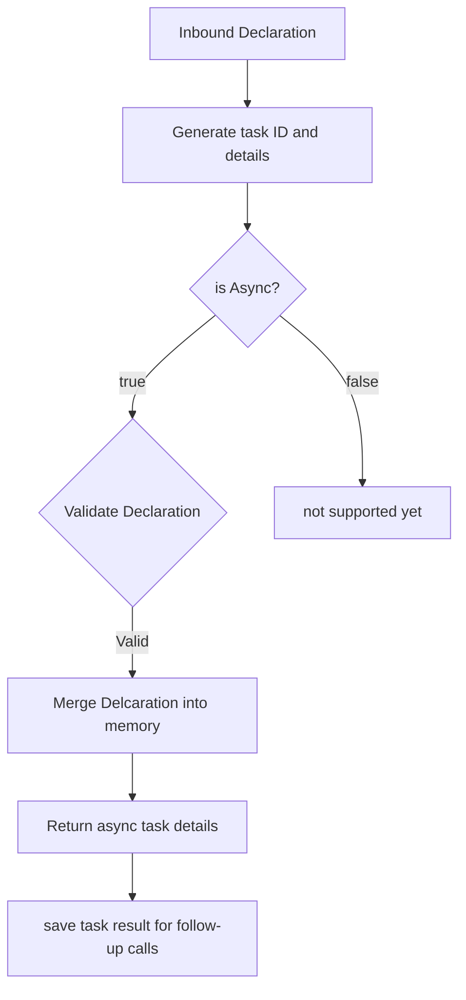

# Welcome to f5-mock-service

This service is to mock common f5 rest api endpoints for more rapid testing without having to deploy an actual f5...

## Current goals

- Support auth classic auth token endpoint
- Support AS3 flows (async)

## as3

AS3 is the main driver for such a mock service.  Being able to quickly and easily test tools with AS3 can be difficult.  The idea here is to provide a simple REST api framework to 'mimic' AS3 functionality.

The mock as3 service should support all the AS3 endpoints and respond in a manner suitable for testing.  

This means that POSTing to the 'delcare' endpoint should validate the declaration and merge with exising tenants.  GET to the 'declare' endpoint should provide the full declaration with all tenants, or specified tenant.

Tasks will also be part of the workflow to round out functionality

Will be adding in the f5-declartion-validator to validate the inbound declarations

### Designed workflow (pending)

Below is the designed workflow, it's actually coded a little different (it will get updated).

